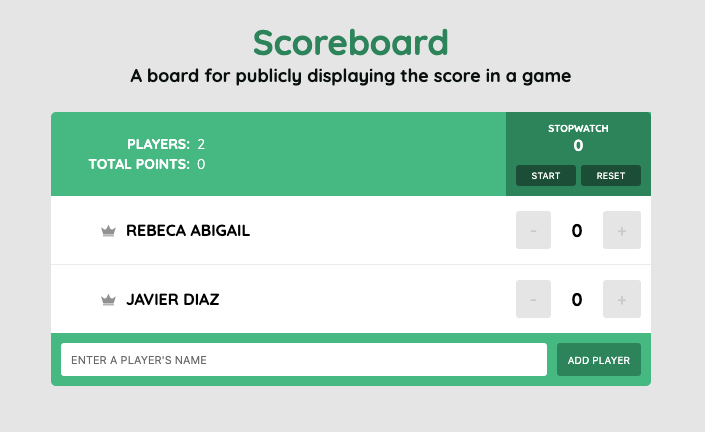

# Scoreboard :sparkles:
### A board for publicly displaying the score in a game

This project is based on [Treehouse](https://teamtreehouse.com/)'s course for create applications with React. But I love Vue, for this reason I builded the same challenge using Vue and Vuex.

If you have a recommendation for this application. Submit an a [issue](https://github.com/coderdiaz/scoreboard/issues/new).



### Getting Started
```sh
# Project setup
yarn install

# Compiles and hot-reloads for development
yarn run serve

# Compiles and minifies for production
yarn run build

# Run your tests
yarn run test

# Lints and fixes files
yarn run lint

# Run your unit tests
yarn run test:unit
```

### Customize configuration
See [Configuration Reference](https://cli.vuejs.org/config/).
